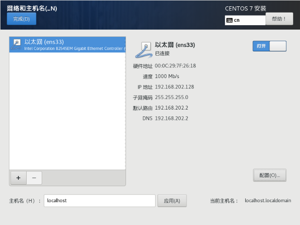

# OJ判题系统

## 实现核心
1. **权限校验**
   
   谁可以执行代码，谁不能执行代码

2. **代码沙箱**
   如何保证用户代码的安全性，如果直接在服务器上运行代码，会对整个系统造成影响
    
    限制沙箱的资源的分配
3. **判题规则**
   
   某些题目需要保证几位的精确度，而某些题目需要准确的答案

4. **任务调度**
   
   服务器资源有限，用户的代码需要排队执行，而不会因为任务过多而拒绝任务的执行

## 核心业务流程

## 需要实现的功能
1. 题目相关服务

   1. 题目创建(admin)
   2. 题目删除(admin)
   3. 题目修改(admin)
   4. 搜索题目
   5. 用户做题
   6. 提交题目代码
2. 用户相关
   1. 用户注册
   2. 用户登录
3. 判题模块
   1. **判题** 输出题目的正确与错误
   2. **沙箱的安全性** 内存溢出，不安全的指令，超时等等
   3. ***自主实现*** 代码沙箱
   4. **开放接口** 将沙箱作为一个服务

## 技术选型
前端：Vue3，Arco Desgin组件库，手撸项目模板，代码在线编辑器，在线文档浏览

后端：Java进程控制，Java安全管理器，部分JVM知识点，虚拟机（云服务器），Docker，Spring Cloud，消息队列

## 技术架构

**用户层**  APP  PC端网站  移动端网站

**接入层**  Nginx  API网关  负载均衡项目

**业务层**  题目模块  判题模块  用户模块

**服务层**  判题服务  用户鉴权服务  通知服务

**存储层**  MySql  Redis  RabbitMQ

**系统环境**  Linux服务器  Docker虚拟机  K8S

## 主流的OJ实现方案
1. 现成的OJ系统
2. 现成的判题API
3. 利用AI
4. 自主开发
5. 利用别人的OJ，模拟浏览器

## 前端搭建

### Vue脚手架搭建
在命令行中输入
~~~shell
 vue create soyaoj
~~~

等待安装完成后，进入到/soyaoj目录，运行npm run serve，进入到Vue欢迎页面即成功
引入arco-design组件：
~~~shell
npm install --save-dev @arco-design/web-vue
~~~

同时在项目main.ts文件中添加
~~~javascript
import ArcoVue from '@arco-design/web-vue';
import '@arco-design/web-vue/dist/arco.css';
~~~

root:123456

## 数据库表设计
#### 题目表
题目标题

题目内容：存放题目的介绍，输入输出的提示，描述与详情

题目标题（json数组字符串）：栈，队列，链表...

题目答案：管理员设置标准答案

提交数：通过题目人数，已提交题目人数，便于统计分析

#### 判题相关字段
输入用例

输出用例

时间限制

内存限制

这部分可以采用JSON对象的形式，JSON易于扩展，未来需要添加字段时不需要再进数据库中修改表

#### 用户提交表
题目id： questionId

语言：language

用户的代码：code

判题状态：status（判题中，待判题，成功，失败）

判题信息（判题过程中得到的一些信息，如程序失败的原因，执行耗时，消耗空间）

judjeInfo（json对象）
~~~json
{
   "message":"程序执行信息",
   "time":"10000",//ms
   "memory":"10000",//kb
}
~~~

执行信息的枚举值：
- Accepted 成功
- Wrong Answer 答案错误
- Compile Error 编译错误
- Memory Limit Exceeded 内存超出
- Time Limit Exceeded 运行超时
- Presentation Error 展示错误（输出多出空格或换行）
- Output Limit Exceeded 输出溢出（某些需要输出文件的题目）
- Waiting 等待中
- Dangerous Operation 危险操作
- Runtime Error
- System Error

#### 后端开发
1) 根据功能设计库表
2) 自动生成对数据库的增删改查
3) 编写Controller实现基本的增删改查和权限校验
4) 根据业务开发新的功能

##### 题目接口

editRequest updateRequest
前者是给用户用的，后者是给管理员用的因而需要分离（权限隔离）

标签列表需要转为List\<String> 类型

同时题目的配置信息可能需要修改，为了便于修改配置，需要为题目配置信息创建一个对应的对象

专门定义VO类：专门给前端返回的对象，可以节约网络传输大小，或者过滤字段，保证安全性。

比如： judgeCase以及answer不能直接返回给用户

**枚举类**：
1. 编程语言
2. 提交状态
3. 执行信息的枚举类
