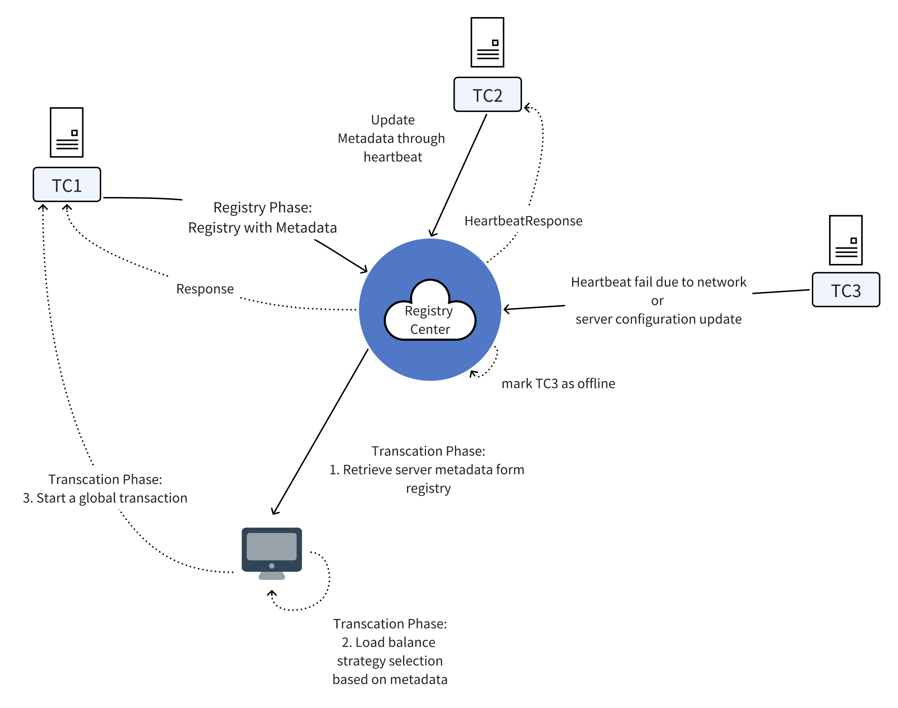

# Unlocking the Power of Metadata in Apache Seata

### OverView

To address the limitations of Seata's current load balancing strategy, we propose enhancing the Transaction Coordinator (TC) with metadata preservation to store service-specific attributes of TC instances. This enables Transaction Managers (TMs) and Resource Managers (RMs) to adopt granular load-balancing strategies (e.g., workload-aware routing or latency-sensitive selection), thereby optimizing the efficiency and throughput of distributed transaction execution.

### BackGround

In Seata (formerly known as Fescar) v0.2.*, foundational load balancing strategies — random and round-robin — were implemented to provide TM and RM with basic mechanisms for TC discovery and request routing.And now, Seata has more strategies including consistent-hash, least-active and XID.

While Seata's current load balancing strategies provide TMs and RMs with a lightweight mechanism for TC discovery, they exhibit significant limitations in specific operational scenarios.

Consider the following scenario in the context of the LeastActiveLoadBalance strategy:

>- TC A has a maximum capacity of 10 connections and currently manages 5 active transactions.
>
>- TC B has a maximum capacity of 5 connections and currently manages 4 active transactions.
>
> Under the LeastActive selection logic, Seata would route the new transaction request to TC B (with 4 active connections) instead of TC A (with 5 active connections but 50% remaining capacity). This exposes a critical flaw in stateless load balancing — the algorithm prioritizes absolute active counts over relative resource availability, leading to suboptimal routing decisions where higher-capacity nodes remain underutilized while smaller nodes risk overloading.

### Current Load Balancing Strategies Analysis

While Seata currently supports multiple load balancing strategies — including RoundRobin, Random, XID, LeastActive, and ConsistentHash — all existing implementations exhibit inherent limitations in production-grade distributed transaction scenarios.

The existing implementation demonstrably fails to maintain high availability of distributed transactions and ensure low-latency network responsiveness under the following critical operational scenarios:

1. As outlined in the scenario mentioned earlier, where TC A and TC B demonstrate distinct transaction processing capacities, the existing metadata framework fails to capture critical performance metrics required for intelligent routing decisions. This architectural limitation prevents the system from dynamically aligning transaction workloads with TC instances' actual throughput capabilities, resource utilization metrics, and hardware profiles.
2. When TMs and RMs are geographically distributed across different physical regions from TCs, the cross-region communication between TMs/RMs and TCs inevitably introduces network latency, which significantly degrades transaction processing performance.
3. In scenarios where TCs are geographically distributed across different regions fro RMs and TMs, the unavailability of TC instances registered in the service registry (due to network partitions, node failures, or health check failures) may result in transaction requests from RMs/TMs being incorrectly routed to unavailable TCs. This misrouting introduces significant transaction processing latency and potential timeout-triggered rollbacks.
4. In scenarios where specific business requirements mandate the use of TCs with encryption capabilities, the current architecture exposes a critical gap: RMs and TMs lack the necessary metadata to discern whether registered TC instances support cryptographic operations.
5. When TCs and RMs/TMs are deployed within the same geographical region, and all TC instances exhibit low resource utilization, RMs/TMs should prioritize routing transaction requests to TC instances with the lowest observed network latency. This latency-sensitive routing strategy optimizes end-to-end transaction processing efficiency.

### Metadata Design
|**Metadada**|**Data type**|**Description**|
|:--------:|:------:|:------------:|
|Weight|float|The load capacity of the instance(relative value)|
|Region|String|The geographical location of the instance|
|Version|String|The seata version of the instance|
|FeatureFlags|String|The features(e.g. encryption) instance support|
|Load|float|Current load metrics.(e.g. CPU utilization percentage and memory usage percentage)|
|Capacity|int|The maximum throughput capacity of a instance(e.g. Tranctions per second or concurrent connections)|
|HealthStatus|short|The status of instance(e.g. healthy/unhealthy/degraded)|
|Environment|int|deployment environment of the instance(e.g. testing/staging/production)|
|Latency|int|Network latency between RM/TM and TC|
|BusinessType|String|Used to categorize TC instances by their respective business lines, such as "Payment Group" or "Order Group"|
|StartTime|Long|A millisecond-precision UTC timestamp indicating when the instance was initialized, used to determine the instance's age and prioritize operations like rolling updates or instance retirement|
|AvgTransactionTime|Long|RMs/TMs should prioritize routing transaction requests to TCs with the lowest historical average transaction execution time, ensuring transactional workloads are preferentially directed to TC instances demonstrating higher processing efficiency|

#### Timing of Metadata Registration to the Service Registry
We can categorize metadata into two types based on their lifecycle phases: initialization during TC registration and incremental updates through heartbeat cycles.
- Initialization during TC registration:
The following metadata attributes — routing weight, deployment region,version, feature flags,environment, capacity, startup timestamp, and business type — must be reported to the service registry during instance registration.

- Incremental updates through heartbeat cycles:
Key performance metrics — including current workload, health status, network latency, and average transaction processing time — should be periodically updated (e.g., every 30 seconds) through heartbeat mechanisms to ensure accurate service discovery and load balancing decisions.

#### More Details about Metadata

1. Weight:
    The weight metadata are statically initialized during instance registration, primarily serving to differentiate the transaction processing capacity of individual instances relative to other members in the cluster. And these weight could be used to Weighted-RoundRobin during routing request.
    ```java
    //static initialization
    public TCMetadata(){
        TCMetadata metadata = new TCMetadata();
        metadata.setWeight(100);
        return metadata;
    }
    ```
    However, note that when using Weighted-RoundRobin, the actual weight value should be a value between 0-1, so the client needs to calculate a value between 0-1 based on the weight fields of all instances when performing load balancing.
2. Region
    The region metadata represents the geographical location of an instance, which can be expressed as a string.
    ```java
    //String expression
    metadata.setRegion("Asia-zn-1");
    //or 
    metadata.setRegion("1-1-1");
    ```
    Where the latter expression maps the location to an integer number,which is easier for data processing. The last digit provides more granular information about the geographical location.
3. Version
    Version metadata, which represents the version information of the current instance, is initialized during instance registration.
    ```java
    metadata.setVersion("v1.6.2");
    ```
4. FeatureFlags
    Feature flags, represented as key-value pairs (KVs), explicitly declare the capabilities and enabled functionalities supported by the current instance.
    ```java
    public HashMap<String,Boolean> featureFlags = new HashMap<>();
    featureFlags.put("raft_consensus",true);
    featureFlags.put("encryption",true);
    ...
    ```

5. Load
    Load metrics metadata — including real-time indicators such as CPU utilization and memory consumption, must be periodically reported to the service registry through heartbeat mechanisms to enable dynamic load balancing and operational health monitoring.
    ```java
    //...caculate cpu usage and memory usage
    TCMetadata metadata = new TCMetadata();

    //e.g. cpu usage = 37.2%  mem usage = 21.4%
    metadata.setCPUUsage(0.372f);
    metadata.setMemUsage(0.214f);

    //...generate payload
    server.sendHeartBeat(payload);
    ```
6. Capacity/Environment/BussinessType/StartTime
    For metadata fields such as Capacity, Environment, BusinessType, and StartTime, these are initialized with static values during instance registration and typically remain unchanged throughout the instance lifecycle unless explicitly reconfigured.
    ```java
    metadata.setCapacity(12);
    // testing / production ...
    metadata.setEnvironment("testing");
    metadata.setBussinessType("Order");
    //...get start timestamp
    metadata.setStartTime(startTimeStamp);
    ```
7. HealthStatus
    The HealthStatus serves as a quick-access indicator for clients to assess the operational viability of server instances. It dynamically evaluates the instance's health state by synthesizing critical status metrics.
8. Latency
    The network latency metric reflects the round-trip time (RTT) between client applications and individual TC instances. To ensure optimal routing, clients should implement the following workflow:
    - Periodically retrieve the full TC instance list from the service      registry
    - Generate instance-latency map. 
        ```java
        // latencycache
        // here results can be asynchronously retrieved.
        for(Instance instance: InstanceList){
            latency = client.pingWithTimeout(instance.getEndPoint(),TIME_OUT);
            latencyCache.put(instance.getId(),latency);
        }
        ```
    - Select a instance with least latency
    Note: This value is locally calculated at the transaction initiation phase and not retrieved from the service registry.
9. AvgTransactionTime
    Average Transaction Execution Time(ATET) measures the mean duration required to complete a transaction from initiation to final commit/rollback. When the instance registry to the center, this metadata should be initialized to 0.

    Each instance should maintain an auxiliary metric tracking the count of currently executed transactions(`TransactionNum`), typically implemented as an atomic counter to ensure thread-safe increments/decrements during transaction lifecycle events (begin/commit/rollback).

    When the cluster is initialized, client are supposed to use random load-balance strategy to route requests, and this metadata could be used when each instance has an ATET(not zero).


### Timeline
##### May 4-20
1. Familiarize with the code and principles of the registry and load balancing module.
2. Research what kind of metadata type could lead to better load balancing strategies, and discuss with the mentor.
3. Familiarize how TM/RM interact with server groups.

##### May 21-28
1. Contribute basic work, such as bug fixes and documentation supplements, to the load balancing and registry module.
##### June 1-14
1. Refactor metadata architecture for server-to-registry data exposure.
2. Add document about the new metadata.
##### June 15-30
1. Refactor registration logic for server initialization with multi-registry support(Nacos, redis, zookeeper, Eureka, Consul, Etcd3...).
##### July 1-14
1. Refactor the registration module's test logic to adapt to the new version of registration logic.
2. Registration module integration testing to test the correctness of the Registration.
##### July 15-31
1. Refactor the hearbeat interaction between server and registry.
2. Compose test to verify the interaction.
3. Write document of new version of heartbeat interacation.
##### August 1-4
1. Implement client-side logic- retrieve metadata from registry.
2. Write mid-term document.

##### August 5-21
1. Provide APIs for custom load balancing strategies based on instance metadata.
2. Write document for custom load balancing strategies.
3. Complete the extension of metadata and its usage on both the server side and client side

##### August 21-25
1. Complete testing of new version.
2. Fix implementation solutions according to the problems found during testing.
3. Write test reports.
4. Write final implementation document.

##### August 25-28
1. Complete the final implementation document.
2. Merge code and perform final finishing work according to the issues raised in the review.


### Personal Information
##### Basic Information
**Name**: Liu Yange
**Email Address**: soliuyan@163.com
**Github Address**: [Soyan](https://github.com/JisoLya)
##### Education Background
XDU, Postgraduate, 2024-2027
##### Skills
1. Proficient in Java programming language and have participated in multiple Java projects.
2. Familiar with distributed consensus algorithms.
3. Familiar with SOFAJRaft library.