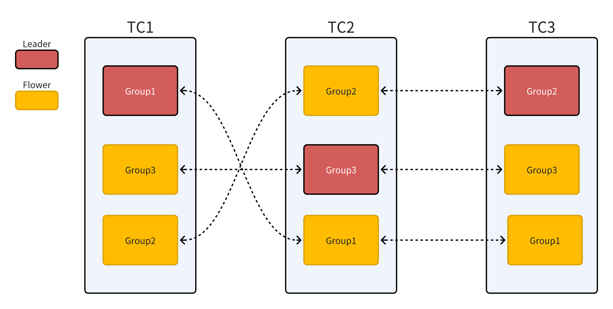
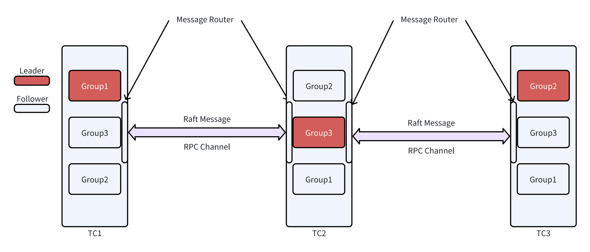

# Extend Seata Multi-Raft cluster mode

### OverView

Due to Seata's file mode storing data in local disk and node memory, it cannot guarantee high availability. On one hand, as a quick-start deployment solution, most users choose db mode for initial setup. On the other hand, for production environments, due to its lack of high availability, file mode is no longer used in production environments. Raft mode was introduced to address the situation mentinoned above.

### Process of current Raft mode

1. Request Routing and Verification

    **Client Request Sent to TC Cluster**
    - The `RaftCoordinator.exceptionHandleTemplate` method first checks whether the current node is the Leader.

    - Only the Leader node can process transaction requests. Non-Leader nodes reject requests and return a NotRaftLeader exception.
2. Transaction Initialization

    **Leader Node Processes Global Transaction Start Request**
    - The Leader node uses the `RaftSessionManager.onBegin` method to handle the global transaction start request.
    - Creates a `GlobalTransactionDTO` and encapsulates it into a `RaftGlobalSessionSyncMsg` synchronization message.
    - Submits the message to the Raft state machine via RaftTaskUtil.createTask.

    **Log Replication and Commit**

    - The Leader submits the transaction start operation as a log entry to the Raft group.
    - Ensures log replication to a majority of nodes via the Raft protocol.
    - After acknowledgment by most nodes, the Leader commits the transaction and creates a global session.
3. Branch Transaction Registration Phase
    **Branch Registration Request**
    - An RM sends a branch transaction registration request to the TC.
    - The request is forwarded to the Leader node via the `RaftCoordinator`.

    **Branch Transaction Handling**
    - The Leader node processes branch registration using the `RaftSessionManager.onAddBranch` method.
    - Creates a `BranchTransactionDTO` and encapsulates it into a `RaftBranchSessionSyncMsg` synchronization message.
    - Submits the message to the Raft state machine for synchronization.

    **Lock Resource Handling**

    - Processes lock resources via `RaftLockManager`.
    - Lock information is synchronized to all nodes through Raft logs.

4. Transaction Commit/Rollback Phase

    **Commit/Rollback Request**
    - A TM sends a commit or rollback request to the TC cluster.
    - The request is forwarded to the Leader node.

    **State Change Synchronization**

    - The Leader processes global transaction state changes via `RaftSessionManager.onStatusChange`.
    - Creates state change messages and synchronizes them to all nodes via Raft logs.

    **Branch Transaction Processing**

    - Processes commit/rollback for all related branch transactions.
    - Branch state changes are handled via `onBranchStatusChange` and synchronized.

    **Lock Release**

    - Releases global transaction locks via `RaftLockManager.releaseGlobalSessionLock`.
    - Lock release operations are synchronized to all nodes via Raft.
5. Transaction Completion Phase

    **Transaction Cleanup**

    - Successfully completed transactions are cleaned up via `RaftSessionManager.onSuccessEnd`.
    - Failed transactions are handled via `onFailEnd`.
    - Transaction session removal operations are synchronized to all nodes via Raft logs.

### Limitation of current Raft mode

1. **Single Raft Group** :The current Raft mode in Seata only supports a single Raft group configuration, which fundamentally constrains horizontal scalability and creates a bottleneck for distributed transaction coordination in large-scale cloud-native environments.

2. **Global Single Point** :All transactional requests must be routed through a single designated Leader node for processing. This centralized processing model creates a performance bottleneck as transaction volume escalates.

3. **Physical Instance Underutilization** :Under heavy workloads, RM/TM components communicate exclusively with the Leader node in the current architecture, while follower instances' computational resources remain untapped. 


### Multi-Raft Design
Introduce a Multi-Raft architecture to fundamentally enhance horizontal scalability. We could run M Raft Groups on N physical instances(M >= N).This design would:

- **Sharded Transaction Data**: Partition transactions based on predefined rules
- **Virtualized Raft Groups**: Multiple autonomous Raft groups manage distinct shards
- **Role Multiplexing**: Each node serves as Leader for some groups, Follower for others



### Key Component Design


1. XID Structure Analysis

    The Seata global transaction ID (XID) follows the standard format:
    ```
    {Ip}:{Port}:{TransactionID}
    ```
    
    - Ip: Ip address of TC server.
    - Port: The port TC server listen on.
    - TransactionID: Unique transaction ID.
    
    Due to the uniqueness of transaction IDs, we can establish routing strategies for different Raft groups(such as: last number of XID % groupNumber).
    
    e.g.
    ```java
        public interface ShardingStrategy {
        /**
        * determine Raft group by XID
        * @param xid 
        * @return Raft Group ID
        */
        String determineGroup(String xid);
    
        /**
        * Get all Raft groups
        * @return All group Ids
        */
        List<String> getAllGroups();
        }

        // Hash sharding strategy
        @LoadLevel(name = "consistent-hash")
        public class ConsistentHashShardingStrategy implements  ShardingStrategy {
        private final ConsistentHashRouter<String> router;
        private final List<String> allGroups;
    
        public ConsistentHashShardingStrategy(List<String> groups) {
            this.allGroups = groups;
            this.router = new ConsistentHashRouter<>(groups, 256);
        }
    
        @Override
        public String determineGroup(String xid) {
            return router.getNode(xid);
        }
    
        @Override
        public List<String> getAllGroups() {
            return allGroups;
        }
    }
    ```
2. Multiple Raft Server Management

    This component extends the existing `RaftServerManager` to support multiple Raft groups operating concurrently. It provides centralized management for all Raft groups running across physical nodes.

    Key responsibilities include:

    - Initializing multiple Raft groups with their individual configurations
    - Managing the lifecycle of each Raft server instance
    - Providing group-specific status information (leader status, term number)
    - Maintaining a global view of all operational groups

3. Enhanced File Registry Integration
    Since Seata's Raft mode currently only supports the file registry center, we enhance this integration to work effectively with multiple Raft groups:

    - Extended File Structure: The file registry is extended to store group-specific information
    - Group-Aware Configuration: Registry entries include group identifiers for routing
    - Leadership Records: Each group's leader information is separately maintained
4. Session Manager
    Current `RaftSessionManager` only support managing all sessions of single Raft group. The Hybrid Session Manager extends Seata's session management capabilities to work with multiple Raft groups. It maintains separate session contexts for each group while providing a unified interface for transaction management. It is needed to create a mapping from XID to a specific Raft group in order to support Multi-Raft.
    
    
    Key features include:
    - Group-specific session managers for isolated transaction state management
    - XID-based routing to appropriate session managers
    - Transaction recovery capabilities across multiple groups
    - Resource locking coordination across groups
    - Efficient state persistence leveraging Raft's replication mechanisms

5. RaftCoordinator
    Current `RaftCoordinator` only support sigle Raft group:
    
    To support Multi-Raft, we need to do following things:
    - When a new request coming to `RaftCoordinator`, it should check leader status when routing request to TC instance.
    - Add routing logic to `exceptionHandleTemplate` to support routing different requests to different Raft groups based on XID.
    - Verify the Leader identity of the target Raft group associated with the request. Method `isPass` should be modified.
    - Maintain independent Leader status for each Raft group. `onApplicationEvent` should be able to process multi-group envents.
    - Monitor leader change events for all Raft groups. 
    - Attach target Raft-Group context to individual requests.

6. Log Replication Issue
    Multi-Raft requires nodes acting as Leader in one Raft group and Follower in another to maintain a single multiplexed RPC channel between endpoint pairs. This connection reuse mechanism prevents quadratic growth (O(n²)) of network connections as cluster scale increases. In this case, we need to add a Raft message routing layer for the two instances to ensure that the logs of each Group are replicated independently.
    

    Additionally, the logs within each instance should be persisted separately to maintain their isolation and integrity.

7. Configuration design

    ```yaml
    seata:
      Raft:
        # enable Multi-Raft mode
        multi-Raft-enabled: true
    
        # sharding strategy
        sharding:
         strategy: default
          group-count: 3
    
        # common Raft config
        snapshot-interval: 600
        apply-batch: 32
        max-append-buffer-size: 262144
        max-replicator-inflight-msgs: 256
        election-timeout-ms: 2000
        serialization: jackson
    
        # specific group config
        groups:
          group-1:
            data-dir: ${user.home}/seata/data/Raft/group-1
            # The first one signifies the leadership status within a particular group
            server-addr: 192.168.0.1:7091,192.168.0.2:7091,192.168.0.3:7091
      
          group-2:
            data-dir: ${user.home}/seata/data/Raft/group-2
            server-addr: 192.168.0.1:7092,192.168.0.2:7092,192.168.0.3:7092

          group-3:
            data-dir: ${user.home}/seata/data/Raft/group-3
            server-addr: 192.168.0.1:7093,192.168.0.2:7093,192.168.0.3:7093
    ```

The architecture of Multi-Raft is shown in the following figure.


### Instance Crash Analysis

Consider the following case: We have 3 physical instances called node1, node2 and node3, and Leader-Follower relation are as follows:
```yaml
group-1: Node1(Leader), Node2(Follower), Node3(Follower) 
group-2: Node2(Leader), Node1(Follower), Node3(Follower)
```

In the current architecture, after the Group1-Leader receives a global transaction request, Group1 starts replicating the transaction request information. If the Group1-Leader fails at this stage, the existing mechanism leverages the `onStartFollowing` callback function to update the Group1-Leader information. The Raft protocol guarantees that only nodes with the most up-to-date logs can be elected as the new Leader. Since the newly elected Leader retains all transaction details from its predecessor, the transaction can continue uninterrupted. Furthermore, subsequent requests for this transaction can also be correctly routed to the new Leader.

For Group2, it can continue operating normally because only a single follower is lost. Even in this scenario, if a leader election is triggered, the remaining nodes can still form a majority quorum to ensure uninterrupted operation.

>**Summary of Actions for Leader Failover**

- Update Routing Table Synchronization
    - Immediately update the global routing table once the new Leader is elected.

- Request Interception and Redirection
    - Non-Leader nodes intercept incoming requests and redirect them to the valid Leader.

- Client Retry and Metadata Refresh
    - Clients receiving a "Not-Leader" response automatically refresh Leader metadata and retry the request.

- Service Discovery Integration
    - Extend the service discovery mechanism to support Multi-Raft group architecture.
- Periodic Synchronization Checks
    - Regularly validate and synchronize routing information to ensure consistency across nodes.

- Coordinator Integration
    - Seamlessly integrate these mechanisms into the existing RaftCoordinator framework.

We can implement an additional mechanism to prevent concurrent failures of multiple Leaders, ensuring transactional availability. 
```java
public void handleNoLeaderAvailable(String group) {
    // 1. try to start new election
    triggerLeaderElection(group);
    
    // 2. consider re-sharding
    if (isElectionTimeout(group)) {
        // excluding current group, route requests to other available group
        redistributeGroupWorkload(group);
        
        notifyOperationTeam("No leader available for group " + group);
    }
}

private void redistributeGroupWorkload(String unavailableGroup) {
    // get all available groups
    List<String> healthyGroups = getHealthyGroups();
    
    if (healthyGroups.isEmpty()) {
        // extreme situation, all groups fail
        enterEmergencyMode();
        return;
    }
    
    // update routing strategy
    shardingStrategy.temporarilyRedistribute(unavailableGroup, healthyGroups);
    
    LOGGER.warn("Temporarily redistributed workload from group {} to groups {}", 
              unavailableGroup, healthyGroups);
}
```
> **Fallback Mode**

When a new Leader cannot be elected (such as when only one node remains), the system needs to enter degraded mode.
```java
private void enterDegradedMode(String group) {
    LOGGER.warn("Entering degraded mode for group: {}", group);
    
    markGroupAsDegraded(group);
    
    // degrade
    if (isReadOnlyModeEnabled()) {
        // readonlymode
        enableReadOnlyMode(group);
    } else {
        // reject
        rejectAllRequests(group);
    }
    
    notifyClientsAboutDegradation(group);
}
```
> **Node Rejoining**

When a node recovers from failure, it must rejoin its original Raft group. To satisfy this recovery requirement, the system must persist node-to-group membership mappings to stable storage during the system startup.

We can enhance the `start` method in `RaftServer` to check whether the node is in status of *rejoin*.

The cluster must atomically synchronize metadata with the latest state following any membership change.

### Multi-Raft Testing

Following the implementation of the Multi-Raft architecture, comprehensive test suites must be developed to validate:

- Leader election correctness across overlapping groups.
- Membership change isolation between shards.

> **Cluster Node Configuration**
- Node Number: 3 physical instances.
- Raft Group Number: 3 Raft groups, each Raft group is responsible for different transaction partitions.

> **Message Routing Testing**
- Ensure that messages from one group are sent to the appropriate group on another instance, which is the foundation of Multi-Raft.

> **Partition Functionality Testing**
- Transaction distribution and routing: Verify transaction is correctly routed to corresponding Raft groups.
- Partition rebalancing: Test data migration during dynamic partition addition/removal.

> **Node Failure Testing**
- Single node failure: Randomly shut down one node, verify system continues normally
- Multiple node failures: 
    - Shut down one non-leader node in each Raft group.
    - Simultaneously shut down leader nodes of multiple Raft groups.

> **Performance Testing**

The key driver for implementing Multi-Raft is to enhance system throughput by fully leveraging compute resources on follower nodes, which remain idle in traditional Raft deployments.

For performance benchmarking, refer to the testing methodology detailed in the link provided below.
[Seata-Raft Storage Mode in Depth and Getting Started](https://seata.apache.org/blog/seata-Raft-detailed-explanation/#4%E5%8E%8B%E6%B5%8B%E5%AF%B9%E6%AF%94)

Performances metrics:
- Transaction requests per second.
- Request response time.
- Transaction concurrency.

### Final Deliverables
1. Refactored `RaftSessionManager` and `RaftCoordinator` to support multi group in single cluster.
2. The Seata Raft mode now adopts the optimized Multi-Raft mode.
3. Guarantee compatibility between the previous and current versions.
4. Provide sufficient test cases.

### Time Line

##### May 4-20
1. Participate in Seata community's communication and familiarize with the code and principles of the Raft mode.
2. Research high-performance implementation solutions for Multi-Raft mode.
3. Familiarize with the usage of current Raft mode.

##### May 21-28
1. Contribute the basic work, such as documentation or bug fixes to seata community.

##### June 1-14
1. Modify the existing Raft group to enable it to support multiple Raft groups.
2. Finalize the Raft message router.

##### June 15-30
1. Modify some data structures in `RaftCoordinator` for future enhancement.
2. Modify global session discovery logic in `RaftCoordinator`.

##### July 1-14
1. Complete logic implementation in `RaftCoordinator`.
2. Write test cases to verify the correctness of the implementation.
3. Deliver mid-term implementation documents.

##### July 15-31
1. Modify `RaftSessionManager` to support Multi-Raft mode.
2. Modify the interaction logic between `RaftCoordinator` and `RaftSessionManager`.
3. Write documentations for new version of `RaftSessionManager`.

##### August 1-4
1. Complete the modification of `RaftSessionManager` and `RaftCoordinator`.

##### August 5-21
1. Complete the tests of Multi-Raft, including:
    - Verify Raft message routing.
    - Verify the request routing.
    - Verify the node failure-recovery mechanism.
    - Verify the degraded mode.
    - Performance testing.
    - Verify compatibility for old versions.
2. Fix implementation solutions according to the problems found during testing.
3. Write test reports.
4. Write final implementation document.

##### August 22-28
1. Improve the final project implementation document, including implementation solutions and test reports.
2. Merge code and perform final finishing work according to the issues raised in the review.

### Personal Information
##### Basic Information
**Name**: Liu Yange
**Email Address**: soliuyan@163.com
**Github Address**: [Soyan](https://github.com/JisoLya)
##### Education Background
XDU, Postgraduate, 2024-2027
##### Skills
1. Proficient in Java programming language and have participated in multiple Java projects.
2. Familiar with distributed consensus algorithms.
3. Familiar with SOFAJRaft library.