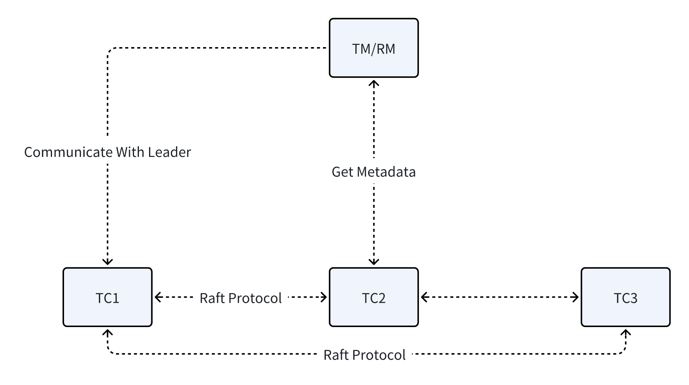

# Extend Seata Muti-raft cluster mode

## OverView

Due to Seata's file mode storing data in local disk and node memory, it cannot guarantee high availability. On one hand, as a quick-start deployment solution, most users choose db mode for initial setup. On the other hand, for production environments, due to its lack of high availability, file mode is no longer used in production environments. Raft mode was introduced to address the situation mentinoned above.

## Process of current Raft mode

1. Request Routing and Verification

    **Client Request Sent to TC Cluster**
    - The `RaftCoordinator.exceptionHandleTemplate` method first checks whether the current node is the Leader.

    - Only the Leader node can process transaction requests. Non-Leader nodes reject requests and return a NotRaftLeader exception.
2. Transaction Initialization

    **Leader Node Processes Global Transaction Start Request**
    - The Leader node uses the `RaftSessionManager.onBegin` method to handle the global transaction start request.

    - Creates a `GlobalTransactionDTO` and encapsulates it into a `RaftGlobalSessionSyncMsg` synchronization message.

    - Submits the message to the Raft state machine via RaftTaskUtil.createTask.

    **Log Replication and Commit**

    - The Leader submits the transaction start operation as a log entry to the Raft group.

    - Ensures log replication to a majority of nodes via the Raft protocol.

    - After acknowledgment by most nodes, the Leader commits the transaction and creates a global session.
3. Branch Transaction Registration Phase
    **Branch Registration Request**

    - An RM sends a branch transaction registration request to the TC.

    - The request is forwarded to the Leader node via the `RaftCoordinator`.

    **Branch Transaction Handling**

    - The Leader node processes branch registration using the `RaftSessionManager.onAddBranch` method.

    - Creates a `BranchTransactionDTO` and encapsulates it into a `RaftBranchSessionSyncMsg` synchronization message.

    - Submits the message to the Raft state machine for synchronization.

    **Lock Resource Handling**

    - Processes lock resources via `RaftLockManager`.

    - Lock information is synchronized to all nodes through Raft logs.

4. Transaction Commit/Rollback Phase
    **Commit/Rollback Request**

    - A TM sends a commit or rollback request to the TC cluster.

    - The request is forwarded to the Leader node.

    **State Change Synchronization**

    - The Leader processes global transaction state changes via `RaftSessionManager.onStatusChange`.

    - Creates state change messages and synchronizes them to all nodes via Raft logs.

    **Branch Transaction Processing**

    - Processes commit/rollback for all related branch transactions.

    - Branch state changes are handled via `onBranchStatusChange` and synchronized.

    **Lock Release**

    - Releases global transaction locks via `RaftLockManager.releaseGlobalSessionLock`.

    - Lock release operations are synchronized to all nodes via Raft.
5. Transaction Completion Phase
    **Transaction Cleanup**

    - Successfully completed transactions are cleaned up via `RaftSessionManager.onSuccessEnd`.

    - Failed transactions are handled via `onFailEnd`.

    - Transaction session removal operations are synchronized to all nodes via Raft logs.

## Limitation of current Raft mode

1. **Single Raft Group** :The current Raft mode in Seata only supports a single Raft group configuration, which fundamentally constrains horizontal scalability and creates a bottleneck for distributed transaction coordination in large-scale cloud-native environments.

2. **Global Single Point** :All transactional requests must be routed through a single designated Leader node for processing. This centralized processing model creates a performance bottleneck as transaction volume escalates.

3. **Physical Instance Underutilization** :Under heavy workloads, RM/TM components communicate exclusively with the Leader node in the current architecture, while follower instances' computational resources remain untapped. 



## Muti-Raft Design
Introduce a Multi-Raft architecture to fundamentally enhance horizontal scalability. We could run M Raft Groups on N physical instances(M >= N).This design would:
1. Shard Transactional Data - Partition transactional datasets based on predefined rules (e.g., resource group hash, application ID ranges).

2. Virtualized Raft Groups - Establish multiple autonomous Raft groups (M >= N physical nodes) to manage distinct shards independently, without requiring additional physical infrastructure.

3. Role Multiplexing - Enable each physical node to simultaneously serve as Leader for specific shards, Follower for others, and Learner for observational shards, achieving:
    - Non-blocking parallel processing across shards
    - Load-balanced resource utilization through intelligent role distribution
    - Elimination of global single-point bottlenecks


### Key Component Design

#### Sharding Strategy

1. XID Structure Analysis

    The Seata global transaction ID (XID) follows the standard format:
    ```
    {Ip}:{Port}:{TransactionID}
    ```
    
    - Ip: Ip address of TC server.
    - Port: The port TC server listen on.
    - TransactionID: Unique transaction ID.
    

    Due to the uniqueness of transaction IDs, we can establish routing strategies for different Raft groups.
    
    e.g.
    ```java
        public interface ShardingStrategy {
        /**
        * determine raft group by XID
        * @param xid 
        * @return Raft Group ID
        */
        String determineGroup(String xid);
    
        /**
        * Get all raft groups
        * @return All group Ids
        */
        List<String> getAllGroups();
        }

        // Hash sharding strategy
        @LoadLevel(name = "consistent-hash")
        public class ConsistentHashShardingStrategy implements  ShardingStrategy {
        private final ConsistentHashRouter<String> router;
        private final List<String> allGroups;
    
        public ConsistentHashShardingStrategy(List<String> groups) {
            this.allGroups = groups;
            this.router = new ConsistentHashRouter<>(groups, 256);
        }
    
        @Override
        public String determineGroup(String xid) {
            return router.getNode(xid);
        }
    
        @Override
        public List<String> getAllGroups() {
            return allGroups;
        }
    }
    ```
2. Mutiple Raft Server Management
    We can modify RaftServerManager or make a new java class to support mutiple raft groups.

    Here’s an outline of what RaftServerManager should do:

    - Initialization:
    It should accept a list of group identifiers and initialize the configuration for each group.

    - RPC Server Setup:
    An RPC server should be created and initialized for inter-node communication.

    - Server Startup and Management:
    The class must provide methods to start each Raft server instance.

    - Leader Election and Status Checks:
    A method should be available to check the leader status of each Raft group.

    - Error Handling and Logging:
    Throughout its operation, the class should handle errors gracefully.

    - Extensibility:
    Optionally, consider allowing dynamic addition or removal of Raft groups after initialization.

3. Session Manager
    SessionHolder is a key utility class in Seata's server-side architecture that manages transaction sessions across different storage backends. For supporting Muti-Raft mode, Its primary responsibilities should include:
    - Supporting Multi-Raft Environments:
    When the session mode is set to use Raft, the class adapts to work with multiple Raft groups rather than a single instance.

    - Loading and Applying Sharding Strategies:
    It uses a sharding strategy to determine all available Raft groups.

    - Instantiating Session Managers:
    For each discovered Raft group, the class creates a dedicated session manager. 

    - Providing Access to Group-Specific Session Managers:
    The class exposes a method to retrieve the session manager for a given group. 

    - Initializing and Starting Multi-Raft Servers:
    After setting up session managers for each group, the class initializes and starts the Multi-Raft server.

    - Monitor Group Leader state
    In Session Manager, it should be able to monitor the group leader state, in case of network partition or instance shutdown, 

4. RaftCoordinator
    Current `RaftCoordinator` only support sigle raft group:
    
    we can change the strategy as following code:
    ```java
   public <T extends AbstractTransactionRequest, S extends AbstractTransactionResponse> 
    void exceptionHandleTemplate(Callback<T, S> callback, T request, S response) {
        // extract xid to determine raft group
        String xid = extractXidFromRequest(request);
        String group = MultiRaftContext.bindGroupByXid(xid);
        //other code
        ...
    }
    private String extractXidFromRequest(AbstractTransactionRequest request) {
        if (request instanceof GlobalBeginRequest) {
            // use XID as sharding keys
            String applicationId = RootContext.getApplicationId();
            return applicationId != null ? applicationId : "default";
        } else if (request instanceof GlobalCommitRequest) {
            return ((GlobalCommitRequest) request).getXid();
        } else if (request instanceof GlobalRollbackRequest) {
            return ((GlobalRollbackRequest) request).getXid();
        } else if (request instanceof BranchRegisterRequest) {
            return ((BranchRegisterRequest) request).getXid();
        } else if (request instanceof BranchReportRequest) {
            return ((BranchReportRequest) request).getXid();
        }
        // default return an empty string
        return "";
    }
    ```

#### Configuration design

```yaml
seata:
  raft:
    # enable muti-raft mode
    multi-raft-enabled: true
    
    # sharding strategy
    sharding:
      strategy: default
      group-count: 3
    
    # common raft config
    snapshot-interval: 600
    apply-batch: 32
    max-append-buffer-size: 262144
    max-replicator-inflight-msgs: 256
    election-timeout-ms: 2000
    serialization: jackson
    
    # specific group config
    groups:
      group-1:
        data-dir: ${user.home}/seata/data/raft/group-1
        server-addr: 192.168.0.1:7091,192.168.0.2:7091,192.168.0.3:7091
      
      group-2:
        data-dir: ${user.home}/seata/data/raft/group-2
        server-addr: 192.168.0.1:7092,192.168.0.2:7092,192.168.0.3:7092
      
      group-3:
        data-dir: ${user.home}/seata/data/raft/group-3
        server-addr: 192.168.0.1:7093,192.168.0.2:7093,192.168.0.3:7093
```


### Instance Crash Analysis

Consider the following case: We have 3 physical instances called node1, node2 and node3, and Leader-Follower relation are as follows:
```yaml
group-1: Node1(Leader), Node2(Follower), Node3(Follower) 
group-2: Node2(Leader), Node1(Follower), Node3(Follower)
```
First of all, `RaftCoordinator` should check leader status when routing request to TC instance. 

In the current architecture, after the Group1-Leader receives a global transaction initiation request, Group1 starts replicating the transaction request information. If the Group1-Leader fails at this stage, the existing mechanism leverages the `onStartFollowing` callback function to update the Group1-Leader information. The Raft protocol guarantees that only nodes with the most up-to-date logs can be elected as the new Leader. Since the newly elected Leader retains all transaction details from its predecessor, the transaction can continue uninterrupted. Furthermore, subsequent requests for this transaction can also be correctly routed to the new Leader.

For Group2, it can continue operating normally because only a single follower is lost. Even in this scenario, if a leader election is triggered, the remaining nodes can still form a majority quorum to ensure uninterrupted operation.

**Summary of Actions for Leader Failover**:

- Centralized Routing Table Synchronization

    - Immediately update the global routing table once the new Leader is elected.

- Request Interception and Redirection

    - Non-Leader nodes intercept incoming requests and redirect them to the valid Leader.

- Client Retry and Metadata Refresh

    - Clients receiving a "Not-Leader" response automatically refresh Leader metadata and retry the request.

- Service Discovery Integration

    - Extend the service discovery mechanism to support Multi-Raft group architecture.

- Periodic Synchronization Checks

    - Regularly validate and synchronize routing information to ensure consistency across nodes.

- Coordinator Integration

    - Seamlessly integrate these mechanisms into the existing RaftCoordinator framework.

We can implement an additional mechanism to prevent concurrent failures of multiple Leaders, ensuring transactional availability. 
```java
public void handleNoLeaderAvailable(String group) {
    // 1. try to start new election
    triggerLeaderElection(group);
    
    // 2. consider re-sharding
    if (isElectionTimeout(group)) {
        // excluding current group, route requests to other available group
        redistributeGroupWorkload(group);
        
        notifyOperationTeam("No leader available for group " + group);
    }
}

private void redistributeGroupWorkload(String unavailableGroup) {
    // get all available groups
    List<String> healthyGroups = getHealthyGroups();
    
    if (healthyGroups.isEmpty()) {
        // extreme situation, all groups fail
        enterEmergencyMode();
        return;
    }
    
    // update routing strategy
    shardingStrategy.temporarilyRedistribute(unavailableGroup, healthyGroups);
    
    LOGGER.warn("Temporarily redistributed workload from group {} to groups {}", 
              unavailableGroup, healthyGroups);
}
```